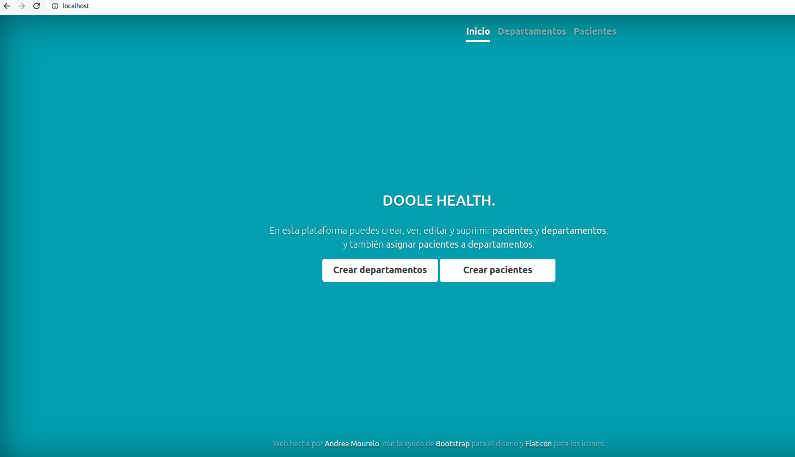

## Sobre este proyecto - DOOLE

Este proyecto consiste en una plataforma web para crear, ver, editar y suprimir pacientes y departamentos, y asignar pacientes a departamentos.

El proyecto funciona con el framework PHP [Laravel](https://laravel.com/) (version 8), un servidor web [Nginx](https://www.nginx.com/) y una base de datos [MySQL](https://www.mysql.com/), juntados y a través de la tecnología de contenedores [Docker](https://www.docker.com/).


## Entidades del proyecto

Para este proyecto, se crearon las entidades siguientes:

<b> * Patient: representa a un o una paciente, y tiene los siguientes atributos: </b>

- _firstName_: nombre de la persona
- _lastName_: primer apellido de la persona

<b> * Department: representa a un departamento, y tiene los siguientes atributos:</b>

- _name_: nombre del departamento

<b> * Assignment: representa las asignaciones de un.a paciente a un departamento, y tiene los siguientes atributos:</b>

- _patient_id_: vinculado a un.a paciente
- _department_id_: vinculado a un departamento

<b> Todas las entidades tienen además:</b>

- _id_: un [UUID](https://en.wikipedia.org/wiki/Universally_unique_identifier), llave primaria de la tabla.
- _created_at_: un timestamp, correspondiendo al momento de creación del objeto.
- _updated_at_: un timestamp, correspondiendo al ultimo momento de modificación del objeto.

## Como lanzar el proyecto (en Linux)

- [ ] Clonar este repositorio

- [ ] Modificar el archivo <b>.env</b>:

- Ejecutar: ```cp .env.example .env```
- Modificar "DB_PASSWORD=" y poner una contraseña ("DB_PASSWORD=<contraseña>")
- En el archivo <b>docker-compose.yml</b>, poner la misma contraseña en la linea "MYSQL_ROOT_PASSWORD:<contraseña>"

- [ ] Ejecutar el comando para lanzar los contenedores de Docker:

```docker-compose up --build --remove-orphans```

- [ ] Entrar en el contenedor de la aplicación: 

```docker exec -it app /bin/bash```

- [ ] Instalar las dependencias

```composer install``` 

- [ ] Crear las tablas en la base de datos e inserir algunos datos

```php artisan migrate``` 

- [ ] Para acceder a la pagina inicial, ir a <b>localhost/</b>

- [ ] Para ver los datos en la base de datos, ir a  <b>localhost:8080/adminer</b> y poner las informaciones siguientes:
- _Server_: database
- _Username_: root
- _Password_: <contraseña>
- _Database_: doole

## Como lanzar los tests automaticos (en Linux)

- [ ]  Entrar en el contenedor de la aplicación:

 ```docker exec -it app /bin/bash```
 
- [ ]  Lanzar los tests:

```php vendor/bin/phpunit```


## Organización de los archivos creados o modificados

>   * 📁 <b>app</b>
>       - 📁 Exception =>
>           * Creación de dos <i>Exceptions</i> para cuando los objetos no existen
>           * Modificación del archivo Handler.php para gestionar las excepciones
>       - 📁 Http
>           - 📁 Controllers
>               * Creación de <i>Controllers</i> para cada entidad (Assignment, Department, Patient) (C en MVC)
>       - 📁 Models
>           * Creación de modelos para las 3 entidades
>       - 📁 Repository
>           * Cada entidad tiene un <i>Repository</i> para gestionar la relación con la base de datos (M en MVC)
>   * 📁 <b>database</b>
>       - 📁 Migrations
>           * Archivos para crear las 3 tablas  `assignments`, `departments` y `patients` en la base de datos, y también algunos datos.
>   * 📁 <b>mysql</b>
>   * 📁 <b>nginx</b>
>   * 📁 <b>php</b>
>   * 📁 <b>public</b>
>      - 📁 css
>           * 📁 assets => archivos de bootstrap para el diseño
>           *  doole.css => archivo usado en general para el css
>   * 📁 <b>resources</b>
>      - 📁 views => Creación de varias views en función de las diferentes páginas (V en MVC)
>   * 📁 <b>routes</b>
>      - web.php => Gestión de las rutas
>   * 📁 <b>tests</b>
>      - 📁 app => Creación de <i>Factories</i> para cada entidad
>      - 📁 Feature => Tests de los controladores y de las excepciones
>      - 📁 Unit => Tests de los <i>Repositories</i>
>  * <b>docker-compose.yml & Dockerfile</b> => Archivos de set up para Docker 
>

## Mejoras posibles

- Crear más atributos y entidades, por ejemplo una entidad <i>Organization</i>, representando la organización a la cual pertenece un departamento, o <i>Disease</i>, representando las enfermedades de un.a paciente.
- Crear un sistema de login, emailing y logs para que la plataforma sea más segura.
- En el estado actual, al suprimir un paciente o un departamento, se suprimen definitivamente de la base de datos. Se podría organizar un sistema de <i>Soft Delete</i> para poder recuperar las plataformas, e incluso tener más visibilidad sobre el uso de la plataforma.
- Crear un sistema de páginas en las listas de pacientes/departamentos, ya que si se tuvieran muchos elementos, la página se colapsaría.
- Crear un sistema de API para interactuar entre la parte de backend y frontend.


## Imagen de la plataforma



## Al finalizar el uso de la plataforma

- [ ] Salir de Docker

- [ ] Parar y suprimir todos los containers:

```docker stop $(docker ps -a -q)```

```docker rm $(docker ps -a -q)```
